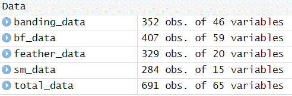

# Introduction
<li>This document serves as a tutorial to manage and merge the different White-throated Sparrow datasets generated by the Woltmann Lab.</li>
<li>The goal of this document it to create a repeatable script for the workflow of any project involving White-throated Sparrow data.</li><br>

# Preparation

## Working Directory
<li>The best way to establish a working directory in R is to use an R project.</li>
<li>Start a new project with file, new project, and new directory.</li>
<li>The location of the .Rproj file in the project folder is the reference for the working directory.</li>
<li>In the project folder create a folder called "scripts" and a folder called "data".</li><br>

## Downloading Datasets
<li> The three datasets which will be utilized for this document are the WTSP banding data google sheet, the WTSP feather data google sheet, and the WTSP sex and morph data google sheet.</li>
<li> To download each google sheet choose file, download, and download as comma separated values(.csv).</li>
<li>Files that are .csv are compatible with R and do not contain additional formatting beyond the values.</li>
<li>Once all three files are downloaded, move them into the "data" folder within your R project folder.</li>
<li>For this script to work name the WTSP banding data "banding_data", the WTSP feather data "feather_data", and the WTSP sex and morph data "sm_data".</li><br>

## Modifying Datasets
<li> The feather dataset has two rows of headers.</li>
<li> R will only recognize one of these as the header, so we must condense it to one row.</li>
<li> R also does not work well with spaces and characters such as the hashtag and parentheses, so we will remove spaces and characters in this section.</li>
<li> Pay close attention to capitalization, as R needs the cases to be matched entirely.</li>
<li> Move New_Recap to the second row.</li>
<li> Move P4_Yes_No and R6_Yes_No to the second row. </li>
<li> Move P4Mass to the second row and change it to P4Mass_mg. </li>
<li> Move P4Length to the second row and change it to P4Length_mm. </li>
<li> Move R6Mass to the second row and change it to R6Mass_mg. </li>
<li> Move R6Length to the second row and change it to R6length_mm. </li>
<li> Move R6Image to the second row </li>
<li> The prefix ij will be used to notate ImageJ. </li>
<li> Change comments to ij_Comments </li>
<li> Change # measured to ij_num_Measured. </li>
<li> Change Measurement (mm) to ij_Measurement_mm.</li>
<li> Change Avg per Bar to ij_Avg_per_Bar. </li>
<li> Delete the first row of the dataset. </li>
<li> Remove the average in the bottom row of the datset. We can always just calculate this in R. </li><br>

# R Workflow

## R Packages
<li> For this application we will use the tidyverse package.</li>
<li> The tidyverse package contains dplyr, ggplot2, readr, and tidyr among others.</li>
<li> To load the tidyverse package use library(tidyverse).</li>
<li> If tidyverse is not installed you can use install.packages("tidyverse")</li><br>

```{r packages, message=FALSE, warning=FALSE}
# install.packages("tidyverse")
library(tidyverse)

```

```{r hidden package, message=FALSE, warning=FALSE, include=FALSE}
library(knitr)  
```
<br>

## Importing Datasets
<li> To import the datasets we will use the read.csv() command.</li>
<li> For this markdown document we have to use "../data/dataset_name.csv" for the location of the file, but in your script it will be "data/dataset_name.csv". </li>
<li> We are assigning the dataset to an object of the same name using <-. </li><br>

```{r load datasets, message=FALSE, warning=FALSE}

banding_data <- read.csv("../data/banding_data.csv")

feather_data <- read.csv("../data/feather_data.csv")

sm_data <- read.csv("../data/sm_data.csv")

```
<br>

## Merge Option 1
<li> Theoretically, if naming convention for columns is the same across all datasets, convention for missing data is the same across all datasets, and data matches across all datasets the following code should  work.</li>
<li> This merges by all columns where both the data and the column name matches.</li>
<li> Entries will not merge and be duplicated when data does not match between datasets and columns conveying the same type of data will be duplicated if their column name does not match.</li><br>

```{r merge 1, message=FALSE, warning=FALSE}
bf_data <- merge(banding_data, feather_data, all = TRUE)

total_data <- merge(bf_data, sm_data, all = TRUE)
```
<br>
```{r 1 results, message=FALSE, warning=FALSE, echo=FALSE, fig.show = "hold", out.width = "100%", fig.align = "center"}

```

<li> The banding dataset is the master dataset, so number of observations should never exceed the number in the banding dataset.</li>
<li> We can see with both combinations bf_data and total_data number of observations exceeds the number in banding_data, so data did not match entirely.</li>
<li> For the combination of banding_data and feather_data we can see that most values of R6_Yes_No did not match for Record 198-265, duplicating those entries. These will need to be changed to the correct values in the incorrect dataset. </li>
<li> There was also an unidentified error in the total_data, and it simply added one dataset to the other without merging.</li><br>

## Merging Option 2
<li> This merging option should work with our datasets as they are.</li>
<li> Assuming that the sex and morph dataset is the most accurate for sex and morph, we will remove those columns from the banding dataset with "banding_data <- select(banding_data, -c("PCRsex", "PCRMorph"))".</li>
<li> We will then change both the feather_data and the sm_data to include only unique or more accurate fields for those datasets using select() in the dplyr package selecting relevant fields and the the fields we wish to use to join.</li>
<li> We will then merge banding and feather data using full_join(dataset1, dataset2, by = field to merge by).</li>
<li> We will then merge the banding feather combined dataset with the sex and morph dataset using full_join().</li>
<li> The full_join() function keeps all values from both datasets, combining them when the field you're joining themm by matches.</li><br>

```{r merge2, message=FALSE, warning=FALSE}
banding_data <- select(banding_data, -c("PCRsex", "PCRMorph"))

feather_data <- select(feather_data, "Record", "P4Mass_mg", "P4Length_mm", "P4Image", "R6Mass_mg", "R6Length_mm", "R6Image", "ij_Comments", "ij_num_Measured", "ij_Measurement_mm", "ij_Avg_per_Bar")

sm_data <- select(sm_data, "SampleID", "PCRsex", "PCRMorph")

bf_data <- full_join(banding_data, feather_data, by = "Record")

total_data <- full_join(bf_data, sm_data, by = "SampleID")
```
<br>
```{r 2 results, message=FALSE, warning=FALSE, echo=FALSE, fig.show = "hold", out.width = "100%", fig.align = "center"}

```
<li> The number of observations remained the same as banding_data across all the joined datasets, meaning all of the record numbers and sample ID numbers matched.</li>
<li> This method works with our datasets as they are. </li>
<li> The downside to this method is it does not tell us which fields did not match across all of the datasets. </li> <br>

## Project Data
<li> We now have a dataset which includes all of our shared WTSP data.</li>
<li> For your project, first use select() to select all of the relevant column headers for your analysis that you need from the total_data.</li>
<li> Remember to include any fields you may be merging by, either record number for repeated measures which may vary with each time we capture the bird, or by SampleID for any measurement which should remain consistent through time like sex and morph.</li>
<li> To merge your dataset simply follow the steps above by importing your dataset, using select() to select the appropriate column headers, and using full_join() to merge your dataset to the project_dataset.</li>
<li> You may need to use as.factor() and as.numeric() to ensure that R reads certain types of data such as Record as a factor and not a continuous variable.</li>
<li> For any fields used in statistical analyses you will need to filter out blanks which may be actually blank, NA, x, or X.</li>
<li> Example code to use is found below.</li><br>

```{r project data, message=FALSE, warning=FALSE}

# project_data <- select(total_data, "columns", "you", "want", "to", "use")

# project_data <- merge(project_data, your_data, by = "SampleID or Record")
 
# project_data <- project_data %>% dplyr::filter(column_header != "x" | column_header != "X" | column_header != "NA" | column_header != "") 

```

# Full Script
<br>
```{r full script, warning=FALSE, message=FALSE, eval=FALSE}
# This script is to merge all of the current shared WTSP datasets for use in various projects
# The best way to establish a working directory in R is to use an R project.
# Start a new project with file, new project, and new directory.
# The location of the .Rproj file in the project folder is the reference for the working directory.
# In the project folder create a folder called "scripts" and a folder called "data".
# Put this script into "scripts"

# The three datasets which will be utilized for this document are the WTSP banding data 
# google sheet, the WTSP feather data google sheet, and the WTSP sex and morph data google sheet.
# To download each google sheet choose file, download, and download as comma separated values(.csv).
# Files that are .csv are compatible with R and do not contain additional formatting beyond  the values.
# Once all three files are downloaded, move them into the "data" folder within your R project folder.
#For this script to work name the WTSP banding data "banding_data", the WTSP feather data "feather_data", and the WTSP sex and morph data "sm_data".

# Modifying Datasets
# The feather dataset has two rows of headers.
# R will only recognize one of these as the header, so we must condense it to one row.
# R also does not work well with spaces and characters such as the hashtag and parentheses, so we will remove spaces and characters in this section.
# Pay close attention to capitalization, as R needs the cases to be matched entirely.</li>
# Move New_Recap to the second row.
# Move P4_Yes_No and R6_Yes_No to the second row. 
# Move P4Mass to the second row and change it to P4Mass_mg. 
# Move P4Length to the second row and change it to P4Length_mm. 
# Move R6Mass to the second row and change it to R6Mass_mg. 
# Move R6Length to the second row and change it to R6length_mm. 
# Move R6Image to the second row 
# The prefix ij will be used to notate ImageJ. 
# Change comments to ij_Comments 
# Change # measured to ij_num_Measured.
# Change Measurement (mm) to ij_Measurement_mm.
# Change Avg per Bar to ij_Avg_per_Bar.
# Delete the first row of the dataset.
# Remove the average in the bottom row of the datset. We can always just calculate this in R.

# For this we will use the tidyverse package, paste the code below into the command line and use ctrl + enter to run it if you do not have tidyverse
# install.packages("tidyverse")

# load the package tidyverse which contains dplyr, ggplot2, readr, and tidyr

library(tidyverse)

# Import the banding, feather, and sex and morph datasets from the data folder

banding_data <- read.csv("data/banding_data.csv")

feather_data <- read.csv("data/feather_data.csv")

sm_data <- read.csv("data/sm_data.csv")

# Remove both the PCRsex and PCRMorph columns from the banding_data to ensure it does not duplicate columns when merging with the sex and morph dataset

banding_data <- select(banding_data, -c("PCRsex", "PCRMorph"))

# Select the columns from the feather_data that need to be added to the banding_data ensuring that the columns included match and are not duplicated

feather_data <- select(feather_data, "Record", "P4Mass_mg", "P4Length_mm", "P4Image", "R6Mass_mg", "R6Length_mm", "R6Image", "ij_Comments", "ij_num_Measured", "ij_Measurement_mm", "ij_Avg_per_Bar")

# Select PCRsex and PCRMorph from the sex and morph data to ensure that the sex and morph data added to banding_data is the most up to date version

sm_data <- select(sm_data, "SampleID", "PCRsex", "PCRMorph")

# full_join() to merge banding data and feather data, which keeps all rows and columns from both datasets
# merging by record as both include repeated measures and record is unique for these sets

bf_data <- full_join(banding_data, feather_data, by = "Record")

# full_join() to merge the already merged dataset with the sex and morph data 
# We are joining by SampleID here as record is not included in the sex and morph dataset and sex and morph remain constant throughout time 

total_data <- full_join(bf_data, sm_data, by = "SampleID")

# For the project you wish to complete simply use the code below, and write the factors you need from the total_data into the different "" slots which you can add more of. 

# project_data <- select(total_data, "columns", "you", "want", "to", "use")

# To merge any additional data use the code below:

# project_data <- full_join(project_data, your_data, by = "SampleID or Record")

# To change factors to factors and numerics to numerics for fields R might have read incorrectly:

#  project_data$column_header <- as.factor(project_data$column_header)
#  project_data$column_header <- as.numeric(wing_sex_clean$column_header)

# To filter out any fields with missing data:
# filter keeps data which matches the conditions
# the symbol for or in dplyr is |, so we are filtering out data which are not x, X, NA, or blank. 
 
# project_data <- project_data %>% dplyr::filter(column_header != "x" | column_header != "X" | column_header != "NA" | column_header != "")

```
<br>

# Recommendations

## Column Headers
<li> Change the two rows of headers on the feather datasheet so that R properly recognizes the correct column names.</li>
<li> Standardize the names of column headers that appear in more than one dataset so that they can properly merge without duplicating.</li>
<li> Remove redundant columns which may not be necessary to include in multiple spreadsheets.</li>
<li> Remove symbols such as hashtags and parentheses from column header names so that they do not cause issues in R.</li>
<li> Remove spaces from column header names so that they do not cause issues in R.</li>
<li> Standardize the use of capitalization or lower cases so that small typos don't break scripts.</li>
<li> Implementing these changes in the google sheets would allow importing the dataset as is.</li>
<li> Needing changes to the datasets before importing could break the script due to small errors such as spelling mistakes, missed capitalizations and more when making changes in excel before importing to R.</li>
<li> Standardizing google sheets to work immediately upon import ensures that shared scripts will always run correctly with no modification to either the script or the downloaded .csv</li><br>

## Data
<li> Some of the data in the same fields does not match across spreadsheats, this needs to be identified and corrected. </li>
<li> Data of the same type that is included in multiple spreadsheets needs to be standardized across all datasheets. For example, PCRMorph should always be "WS" or "TS" with no "ws" in any sheets. Measured values should include the same number of significant figures so it matches across datasheets. This is already good for the most part</li>
<li> Missing data or data waiting to be processed should use a standardized notation.</li>
<li> My suggestion would to leave all missing and data that has not been processed as completely blank as it can be removed easily in R. One way to notate the difference would be to highlight cells waiting for data to be processsed in yellow, and to leave cells where we don't have the data as clear. When the sheet is downloaded as a CSV this formatting will not be included. This way the google sheet has an annotation which does not complicate using the data in R.</li>
<li> A "master sheet" which includes all of the factors across all spreadsheets, the standardized names, and the form the data should entered in could help keep track of this so that it stays consistent not only with our current sheets, but any additional datasets that are generated."</li>


